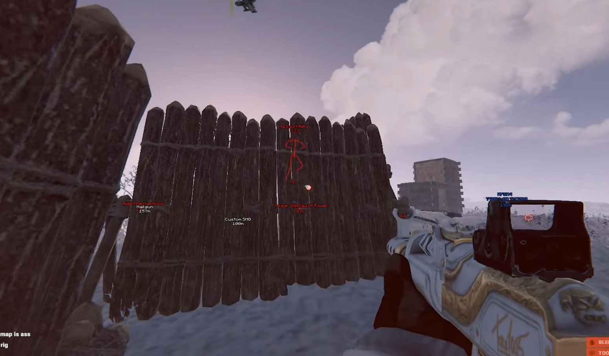

# RUST MINI CHEAT

## MODES
1. **ESP**
2. **God Mode**
3. **Resouce tracking**
4. **Recoil control**

## INSTALLATION GUIDE

1. **Run .exe as Administrator** for full access
2. **Launch Rust**
3. **Press INSERT key** to open the menu

## SCREENSHOTS

